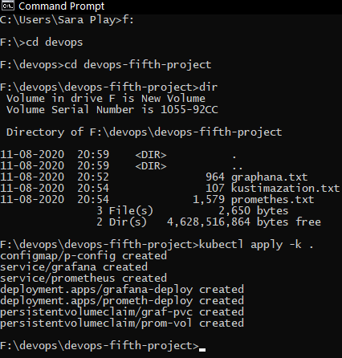
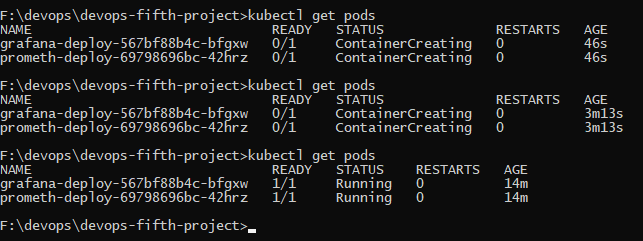
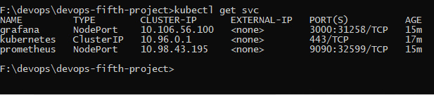
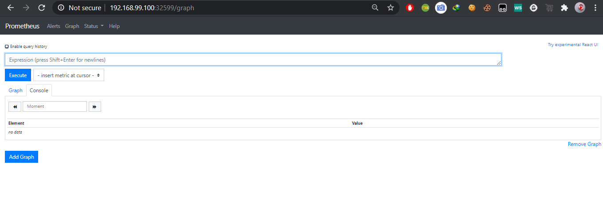
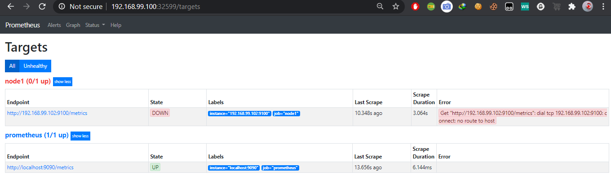

# devops_5
Integrate Prometheus and Grafana and perform in following way:

1.  Deploy them as pods on top of Kubernetes by creating resources Deployment, ReplicaSet, Pods or Services

2.  And make their data to be remain persistent 

3.  And both of them should be exposed to outside world

## My Solution for this problem is:
 
### Step 1: We have created the deployment of the Grafana.

* We have used the service to expose the grafana to the outer world

* Then we have created the PVC to remain data persistance

```
For Code see the grafana.yml attached to this
```

### Step 2: We have created the deployment of the Prometheus.

* We have used the service to expose the prometheus to the outer world

* Then we have created the PVC to remain data persistance

* We have used the config map to 

* Then we have created the PVC to remain data persistance

```
For Code see the prom.yml attached to this
```

### Step 3: We have created kustomization file to run both the files by a single command

```
For Code see the kustomization.yml attached to this

kubectl apply -k .
```


* All created successfully



* It is taking time as it is downloading from the docker hub and it depends on the internet speed

### All the setup has been done, Now check port number of the graphana and prometheus 



### Outputs:


* Grafana opened


* First time it ask to change the password by default it is admin(username and password)


* Grafana interface



* Prometheus opened



* Prometheus interface

### Note

The pods are launced using Deployment so it will monitor the continers running, if they fails or stops by any reasons then ReplicaSet automatically starts or launch the OS within a sec with the same confirguration.

## Built With

* RHEL-8 Running in Virtual Box

* Kubernetes installed by minikube and also running in RHEL 8

## Author

[SAURAV PATEL](https://www.linkedin.com/in/saurav-patel-148539151/)
